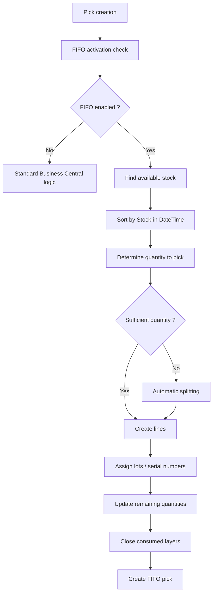

# FIFO Pick Process

## Purpose

The FIFO pick process enables the system to automatically select stock based on its age to ensure consumption follows the principle:

```text
First In
First Out
(First In, First Out)
```

Unlike the standard Business Central behavior, which primarily relies on location selection rules and storage priorities, the Syntoralis FIFO Logistic solution uses the actual stock-in date to determine which stock should be picked first.

The goal is to ensure optimal stock rotation while remaining compatible with standard warehouse management features.

---

# General principle

When a warehouse pick is created, the FIFO engine analyzes available stock and identifies the oldest quantities to consume.

The system relies on the field:

```text
LIS-LOG-FIFO Stock-in DateTime
```

which represents the date and time when the goods were stocked.

Stocks are then sorted in ascending order to select the oldest quantities before the newest.

---

# Activation conditions

The FIFO process runs only when:

```text
FIFO Setup.Activate = TRUE
```

and

```text
Location.Pick Stock-in Movement = TRUE
```

If either condition is not met, Business Central applies its standard behavior.

---

# Trigger points

The FIFO engine runs when the following documents are created:

- Warehouse Pick
- Inventory Pick
- Inventory Movement
- Location replenishment
- Automatically generated warehouse activities

---

# Finding available stock

## Step 1 - Identify stock

The system identifies all location contents matching:

- the requested item;
- the concerned location;
- the storage unit;
- any lot or serial criteria.

Only available quantities are considered.

---

## Step 2 - FIFO sorting

Records are sorted by:

```text
Stock-in DateTime
```

in ascending order.

Example:

```text
Bin A - 2025-01-01 08:00
Bin B - 2025-01-03 10:15
Bin C - 2025-01-10 15:30
```

Pick order:

```text
1. Bin A
2. Bin B
3. Bin C
```

---

# Quantity allocation

## Case 1 - Sufficient quantity available

If the first location contains the required quantity:

```text
Requirement = 50
Bin A = 100
```

The system creates a single pick line:

```text
Bin A = 50
```

---

## Case 2 - Quantity across multiple FIFO layers

If the required quantity is spread across multiple FIFO layers:

```text
Requirement = 100

Bin A = 40
Bin B = 30
Bin C = 80
```

The system automatically creates:

```text
Line 1 = Bin A = 40
Line 2 = Bin B = 30
Line 3 = Bin C = 30
```

Older layers are always fully consumed before moving to the next.

---

# Lot handling

## Principle

When the item is lot-tracked, the FIFO engine applies FIFO rules within the available stock per lot.

The system:

- identifies available lots;
- sorts lots by stock-in date;
- selects the oldest lots;
- automatically assigns tracking information.

---

## Example

```text
Lot LOT001 = 2025-01-10
Lot LOT002 = 2025-01-20
Lot LOT003 = 2025-02-01
```

Consumption order:

```text
LOT001
LOT002
LOT003
```

---

# Serial number handling

## Principle

For serial-tracked items:

- each serial number has its own FIFO layer;
- serials are sorted by stock-in date;
- the oldest are selected first.

---

## Duplicate checks

The system verifies that a serial number or lot is not assigned multiple times to the same pick.

This validation prevents:

- duplicate tracking assignments;
- quantity inconsistencies;
- errors when posting the pick.

---

# FEFO compatibility

## Principle

For items that also use FEFO (First Expired First Out) logic, the FIFO engine remains compatible with standard expiration date selection rules.

Items incompatible with FEFO selection are automatically excluded to avoid logic conflicts.

---

# Updating FIFO layers

After pick creation:

- remaining quantities are recalculated;
- consumed FIFO layers are updated;
- fully consumed layers are closed;
- available stock information is refreshed.

Example:

```text
Before pick:

Inbound 1 = 100
Remaining Qty = 100

Pick = 60
```

Result:

```text
Remaining Qty = 40
Open = TRUE
```

---

# Edge cases

## Insufficient quantity

If available stock is insufficient:

```text
Requirement = 100
Available = 80
```

The system picks the 80 units available following FIFO order.

Final behavior then depends on Business Central's standard controls.

---

## Multiple locations

When multiple locations contain stock:

- FIFO remains the primary criterion;
- location ranking is used only as a complement to FIFO rules.

---

## Multiple items

Each item has its own FIFO history.

Processing is performed independently per item.

---

# Business rules

## PP001

Stock must always be consumed according to the oldest available stock-in date.

## PP002

The Stock-in DateTime field is the primary selection criterion.

## PP003

Pick lines may be automatically split to respect FIFO order.

## PP004

Remaining quantities of FIFO layers must be updated after each consumption.

## PP005

A FIFO layer with remaining quantity zero must be closed.

## PP006

Lots and serial numbers must never be assigned multiple times to the same pick document.

## PP007

The FIFO process must never modify original movements.

---

# Detailed process



---

# Key concept

The FIFO pick engine is the operational core of the solution.

Thanks to the information reconstructed by the recompute process, it can:

- identify available FIFO layers;
- automatically select the oldest stock;
- handle lots and serials;
- split lines when needed;
- enforce stock rotation according to FIFO principles.

The result is a pick driven by the actual age of the stock rather than by its warehouse location alone.

---

[Index](./index-en.html)
