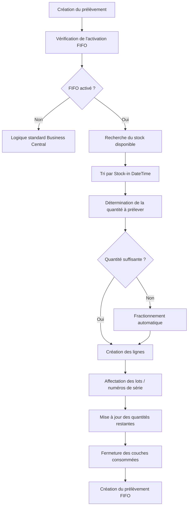

# Processus de Prélèvement FIFO

## Objectif

Le processus de prélèvement FIFO permet au système de sélectionner automatiquement les stocks selon leur ancienneté afin de garantir une consommation conforme au principe :

```text
Premier Entré
Premier Sorti
(First In, First Out)
```

Contrairement au comportement standard de Business Central, qui s'appuie principalement sur les règles de sélection d'emplacements et les priorités de stockage, la solution Syntoralis FIFO Logistic utilise la date réelle d'entrée en stock pour déterminer le stock devant être prélevé en priorité.

L'objectif est de garantir une rotation optimale des stocks tout en conservant la compatibilité avec les fonctionnalités standards de gestion d'entrepôt.

---

# Principe général

Lors de la création d'un prélèvement entrepôt, le moteur FIFO analyse les stocks disponibles et identifie les quantités les plus anciennes à consommer.

Le système s'appuie sur le champ :

```text
LIS-LOG-FIFO Stock-in DateTime
```

qui représente la date et l'heure d'entrée en stock de la marchandise disponible.

Les stocks sont ensuite triés par ordre croissant afin de sélectionner les quantités les plus anciennes avant les plus récentes.

---

# Conditions d'activation

Le processus FIFO est exécuté uniquement lorsque :

```text
FIFO Setup.Activate = TRUE
```

et

```text
Location.Pick Stock-in Movement = TRUE
```

Si l'une de ces conditions n'est pas remplie, Business Central applique son comportement standard.

---

# Déclenchement du processus

Le moteur FIFO intervient lors de la création des documents suivants :

- Prélèvement entrepôt (*Warehouse Pick*)
- Prélèvement inventaire (*Inventory Pick*)
- Mouvement inventaire (*Inventory Movement*)
- Réapprovisionnement d'emplacement
- Activités entrepôt générées automatiquement

---

# Recherche du stock disponible

## Étape 1 - Identification des stocks

Le système identifie tous les contenus d'emplacement correspondant :

- à l'article demandé ;
- à l'emplacement concerné ;
- à l'unité de stockage concernée ;
- aux éventuels critères de lot ou de numéro de série.

Seules les quantités disponibles sont retenues.

---

## Étape 2 - Tri FIFO

Les enregistrements sont triés selon :

```text
Stock-in DateTime
```

dans l'ordre croissant.

Exemple :

```text
Bin A - 01/01/2025 08:00
Bin B - 03/01/2025 10:15
Bin C - 10/01/2025 15:30
```

Ordre de prélèvement :

```text
1. Bin A
2. Bin B
3. Bin C
```

---

# Allocation des quantités

## Cas 1 - Quantité disponible suffisante

Si le premier emplacement contient la quantité nécessaire :

```text
Besoin = 50
Bin A = 100
```

Le système crée une seule ligne de prélèvement :

```text
Bin A = 50
```

---

## Cas 2 - Quantité répartie sur plusieurs couches FIFO

Si la quantité nécessaire est répartie sur plusieurs couches FIFO :

```text
Besoin = 100

Bin A = 40
Bin B = 30
Bin C = 80
```

Le système crée automatiquement :

```text
Ligne 1 = Bin A = 40
Ligne 2 = Bin B = 30
Ligne 3 = Bin C = 30
```

Les couches les plus anciennes sont toujours consommées intégralement avant les suivantes.

---

# Gestion des lots

## Principe

Lorsque l'article est géré par lot, le moteur FIFO applique les règles FIFO à l'intérieur des stocks disponibles.

Le système :

- identifie les lots disponibles ;
- trie les lots selon leur date d'entrée en stock ;
- sélectionne les lots les plus anciens ;
- affecte automatiquement les informations de suivi.

---

## Exemple

```text
Lot LOT001 = 10/01/2025
Lot LOT002 = 20/01/2025
Lot LOT003 = 01/02/2025
```

Ordre de consommation :

```text
LOT001
LOT002
LOT003
```

---

# Gestion des numéros de série

## Principe

Pour les articles suivis par numéro de série :

- chaque numéro de série possède sa propre couche FIFO ;
- les numéros de série sont triés selon leur date d'entrée ;
- les plus anciens sont sélectionnés en priorité.

---

## Contrôle des doublons

Le système vérifie qu'un numéro de série ou un lot ne soit pas affecté plusieurs fois au même prélèvement.

Cette validation évite :

- les doublons de suivi ;
- les incohérences de quantité ;
- les erreurs lors de l'enregistrement du prélèvement.

---

# Compatibilité FEFO

## Principe

Pour les articles utilisant également une logique FEFO (*First Expired First Out*), le moteur FIFO conserve la compatibilité avec les règles standard de gestion des dates d'expiration.

Les articles incompatibles avec la sélection FEFO sont automatiquement exclus afin d'éviter tout conflit de logique.

---

# Mise à jour des couches FIFO

Après création du prélèvement :

- les quantités restantes sont recalculées ;
- les couches FIFO consommées sont mises à jour ;
- les couches totalement consommées sont fermées ;
- les informations du stock disponible sont actualisées.

Exemple :

```text
Avant prélèvement :

Entrée 1 = 100
Remaining Qty = 100

Prélèvement = 60
```

Résultat :

```text
Remaining Qty = 40
Open = TRUE
```

---

# Cas particuliers

## Quantité insuffisante

Si le stock disponible est insuffisant :

```text
Besoin = 100
Disponible = 80
```

Le système prélève les 80 unités disponibles selon l'ordre FIFO.

Le comportement final dépend ensuite des contrôles standards de Business Central.

---

## Plusieurs emplacements

Lorsque plusieurs emplacements contiennent du stock :

- le critère FIFO reste prioritaire ;
- le classement des emplacements n'est utilisé qu'en complément des règles FIFO.

---

## Plusieurs articles

Chaque article possède son propre historique FIFO.

Le traitement est réalisé indépendamment pour chaque article.

---

# Règles métier

## PP001

Le stock doit toujours être consommé selon la plus ancienne date d'entrée disponible.

## PP002

Le champ *Stock-in DateTime* constitue le critère principal de sélection.

## PP003

Les lignes de prélèvement peuvent être automatiquement fractionnées afin de respecter l'ordre FIFO.

## PP004

Les quantités restantes des couches FIFO doivent être mises à jour après chaque consommation.

## PP005

Une couche FIFO dont la quantité restante atteint zéro doit être fermée.

## PP006

Les lots et numéros de série ne doivent jamais être affectés plusieurs fois au même document de prélèvement.

## PP007

Le processus FIFO ne doit jamais modifier les mouvements d'origine.

---

# Processus détaillé



---

# Concept clé

Le moteur de prélèvement FIFO constitue le cœur opérationnel de la solution.

Grâce aux informations reconstruites lors du processus de recalcul, il est capable de :

- identifier les couches FIFO disponibles ;
- sélectionner automatiquement le stock le plus ancien ;
- gérer les lots et numéros de série ;
- fractionner les lignes si nécessaire ;
- garantir une rotation des stocks conforme aux principes FIFO.

Le résultat est un prélèvement entièrement piloté par l'ancienneté réelle du stock plutôt que par sa seule localisation dans l'entrepôt.

---

[Index](./index.html)