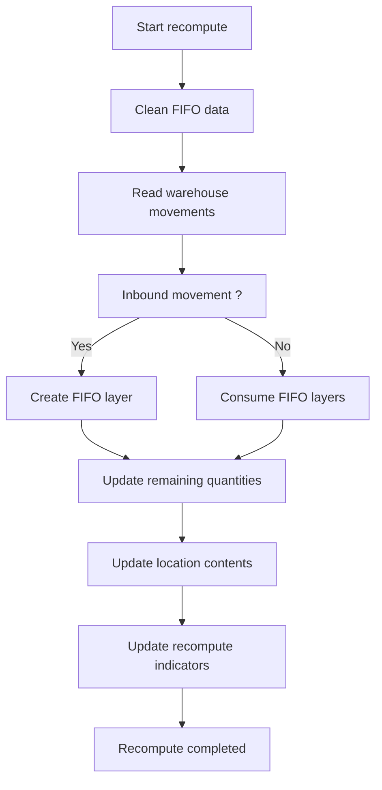

# FIFO Recompute Process

## Purpose

The **FIFO Recompute** process initializes or rebuilds all FIFO data from the existing history of warehouse movements.

This operation is essential when bringing the FIFO solution into service on an already-used environment, because historical movements do not initially contain the information required by the FIFO engine.

The recompute specifically allows to:

- Reconstruct historical FIFO layers.
- Determine the remaining quantity of each inbound movement.
- Calculate FIFO stock dates (*Stock-in DateTime*).
- Update FIFO information used during picks.
- Ensure data consistency before activating the solution.

---

# When to run the recompute?

Run the recompute process in the following situations:

## Initial go-live

When deploying the FIFO solution for the first time on an existing database.

## FIFO data reset

After correcting or rebuilding stock data.

## Consistency checks

When inconsistencies are detected between:

- warehouse entries,
- location contents,
- remaining FIFO quantities.

---

# How it works

The FIFO engine never alters the original movements.

Instead, it replays the chronological history of warehouse movements to reconstruct the expected FIFO state.

For each movement:

- inbound movements populate FIFO layers;
- outbound movements consume the oldest FIFO layers;
- remaining quantities are recalculated;
- FIFO dates are updated.

At the end of the process, the system reaches the same stock level as before but with fully reconstructed FIFO information.

---

# Process steps

## Step 1 - Initialization

The system initializes processing for the selected warehouse.

Actions performed:

- Verify FIFO configuration.
- Read the last processed entry number.
- Optionally lock the process to prevent concurrent executions.

---

## Step 2 - Clean FIFO data

The system deletes or resets previously calculated FIFO information.

Examples:

```text
Open
Remaining Qty
Stock-in DateTime
```

This step ensures the recompute starts from a clean state.

---

## Step 3 - Read warehouse movements

The system rereads all warehouse movements in chronological order.

Processing order:

```text
Date
Time
Entry number
```

Each movement is analyzed to determine its impact on FIFO layers.

---

## Step 4 - Rebuild FIFO layers

For each positive movement:

```text
Stock in
Receipt
Inbound movement
```

the system:

- creates a FIFO layer;
- marks the layer as open;
- initializes the remaining quantity;
- computes the FIFO stock date.

Example:

```text
Inbound 100 units
=
Open = Yes
Remaining Qty = 100
Stock-in DateTime = Movement date/time
```

---

## Step 5 - FIFO consumption

For each negative movement:

```text
Pick
Shipment
Outbound movement
```

the system searches for the oldest open FIFO layer.

Consumption follows the rule:

```text
First In
First Out
```

Each layer's remaining quantity is decremented until the outbound movement is fully consumed.

---

## Step 6 - Update location contents

Once FIFO layers are reconstructed, the system updates location contents.

Field updated:

```text
LIS-LOG-FIFO Stock-in DateTime
```

This information is then used during FIFO pick generation.

---

## Step 7 - Finalization

When processing completes:

- the warehouse is marked as recomputed;
- the recompute date/time is recorded;
- the last processed entry number is stored.

The following fields are updated:

```text
LIS-LOG-FIFO RecomputeDone
LIS-LOG-FIFO RecomputeDateTime
LIS-LOG-FIFO Re. MaxEntryNo
```

---

# Recompute queue

Recomputes are managed via a dedicated queue per warehouse. (Create from FIFO Settings.)

Each request includes, among others:

```text
Warehouse code
Max iterations
Reset
User
Status
```

Possible states:

```text
Pending
Processing
Completed
Failed
```

The Max iterations parameter prevents massive recomputes and allows segmenting the process into batches. If processing does not reach the last warehouse write line, a new job can be scheduled.
Reset allows restarting from scratch for that warehouse so the entire history is recomputed.

This approach enables background processing of recomputes without blocking users.

---

# Business rules

## RC001

The recompute must be executed before globally activating FIFO in FIFO settings.

## RC002

A warehouse cannot be used in FIFO mode until its recompute is finished.

## RC003

The recompute reconstructs FIFO data but never modifies historical movements.

## RC004

Remaining FIFO quantities must exactly match available stock at the end of processing.

## RC005

Stock is always consumed from the oldest open FIFO layer.

## RC006

The FIFO date on location contents must correspond to the oldest available FIFO layer for that item.

---

# Recommended checks after recompute

After recompute execution, it is recommended to verify:

- absence of errors in the queue;
- the Recompute Done status on locations;
- recompute timestamps;
- consistency between physical stock and remaining FIFO quantities;
- presence of a Stock-in DateTime value on location contents.

---

# Implementation procedure

## Step 1

Open the location card.

## Step 2

Run the action:

```text
Recompute FIFO
```

## Step 3

Wait for processing to complete.

## Step 4

Verify:

```text
Recompute Done = TRUE
```

## Step 5

Check:

```text
Recompute DateTime
```

## Step 6

Repeat the operation for all locations included in the FIFO scope.

## Step 7

Once all locations are recomputed, activate:

```text
FIFO Setup -> Activate = TRUE
```

---

# Recompute flow



---

# Key concept

The FIFO recompute is the foundation of the solution.

Without recompute:

- no reliable FIFO layers exist;
- FIFO dates are not available;
- FIFO picks cannot be guaranteed.

The recompute process is therefore mandatory before activating the solution and before any operational use of FIFO features.

---

[Index](./index-en.html)