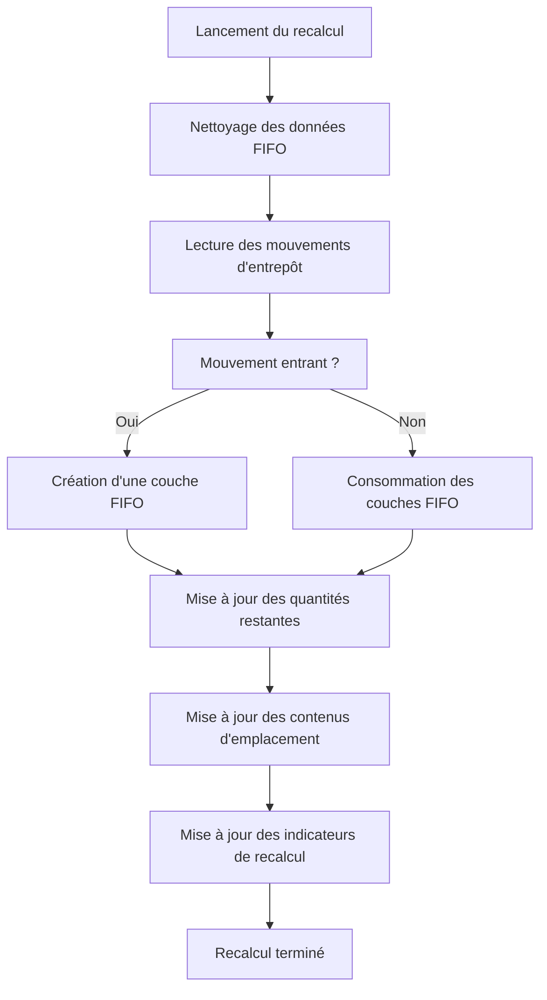

# Processus de Recalcul FIFO

## Objectif

Le processus de **Recalcul FIFO** permet d'initialiser ou de reconstruire l'ensemble des données FIFO à partir de l'historique existant des mouvements d'entrepôt.

Cette opération est indispensable lors de la mise en service de la solution FIFO sur un environnement déjà utilisé, car les mouvements historiques ne contiennent pas initialement les informations nécessaires au moteur FIFO.

Le recalcul permet notamment de :

- Reconstituer les couches FIFO historiques.
- Déterminer la quantité restante de chaque mouvement d'entrée.
- Calculer les dates de stock FIFO (*Stock-in DateTime*).
- Mettre à jour les informations FIFO utilisées lors des prélèvements.
- Garantir la cohérence des données avant l'activation de la solution.

---

# Quand exécuter le recalcul ?

Le recalcul doit être exécuté dans les situations suivantes :

## Mise en service initiale

Lors du premier déploiement de la solution FIFO sur une base de données existante.

## Réinitialisation des données FIFO

Après correction ou reconstruction des données de stock.

## Vérification de cohérence

Lorsque des incohérences sont détectées entre :

- les entrées entrepôt,
- les contenus d'emplacement,
- les quantités FIFO restantes.

---

# Principe de fonctionnement

Le moteur FIFO ne modifie pas les mouvements d'origine.

À la place, il rejoue chronologiquement l'historique des mouvements d'entrepôt afin de reconstruire l'état FIFO attendu.

Pour chaque mouvement :

- les entrées alimentent les couches FIFO ;
- les sorties consomment les couches FIFO les plus anciennes ;
- les quantités restantes sont recalculées ;
- les dates FIFO sont mises à jour.

À la fin du traitement, le système retrouve le même niveau de stock que l'existant mais avec des informations FIFO totalement reconstruites.

---

# Étapes du processus

## Étape 1 - Initialisation

Le système initialise le traitement pour le magasin sélectionné.

Actions effectuées :

- Vérification de la configuration FIFO.
- Lecture du dernier numéro de mouvement traité.
- Verrouillage éventuel du traitement pour éviter les exécutions simultanées.

---

## Étape 2 - Nettoyage des données FIFO

Le système supprime ou réinitialise les informations FIFO calculées précédemment.

Exemples :

```text
Open
Remaining Qty
Stock-in DateTime
```

Cette étape garantit que le recalcul repart d'un état propre.

---

## Étape 3 - Lecture des entrées d'entrepôt

Le système relit l'ensemble des mouvements d'entrepôt dans l'ordre chronologique.

Ordre de traitement :

```text
Date
Heure
Numéro d'entrée
```

Chaque mouvement est analysé afin de déterminer son impact sur les couches FIFO.

---

## Étape 4 - Reconstruction des couches FIFO

Pour chaque mouvement positif :

```text
Entrée stock
Réception
Mouvement entrant
```

le système :

- crée une couche FIFO ;
- marque la couche comme ouverte ;
- initialise la quantité restante ;
- calcule la date de stock FIFO.

Exemple :

```text
Entrée 100 unités
=
Open = Oui
Remaining Qty = 100
Stock-in DateTime = Date/Heure du mouvement
```

---

## Étape 5 - Consommation FIFO

Pour chaque mouvement négatif :

```text
Prélèvement
Expédition
Mouvement sortant
```

le système recherche la couche FIFO ouverte la plus ancienne.

La consommation est effectuée selon la règle suivante :

```text
Premier Entré
Premier Sorti
```

La quantité restante de chaque couche est décrémentée jusqu'à consommation complète du mouvement.

---

## Étape 6 - Mise à jour des contenus d'emplacement

Une fois les couches FIFO reconstruites, le système met à jour les contenus d'emplacement.

Champ mis à jour :

```text
LIS-LOG-FIFO Stock-in DateTime
```

Cette information sera ensuite utilisée lors de la génération des prélèvements FIFO.

---

## Étape 7 - Finalisation

Une fois le traitement terminé :

- le magasin est marqué comme recalculé ;
- la date du dernier recalcul est enregistrée ;
- le dernier numéro d'entrée traité est mémorisé.

Les champs suivants sont mis à jour :

```text
LIS-LOG-FIFO RecomputeDone
LIS-LOG-FIFO RecomputeDateTime
LIS-LOG-FIFO Re. MaxEntryNo
```

---

# File d'attente de recalcul

Le recalcul est géré via une file d'attente dédiée pour chaque magasin. (Créer depuis les Paramètres FIFO.)

Chaque demande contient notamment :

```text
Code magasin
Nombre max d'itération
Réinitialiser 
Utilisateur
Statut
```

États possibles :

```text
Pending
Processing
Completed
Failed
```

Le Nombre max d'itération permet d'éviter un recalcul massif et de segmenter celle-ci par lot. Si le traitement n'est pas arrivée à la dernière ligne d'écriture entrepot alors un nouveau traitement est disponible.
Réinitialiser permet de repartir de zéro pour ce magasin l'ensemble de l'historique est alors recalculé.

Cette approche permet de traiter les recalculs en arrière-plan sans bloquer les utilisateurs.

---

# Règles métier

## RC001

Le recalcul doit être exécuté avant l'activation globale du FIFO dans les paramètres FIFO.

## RC002

Un magasin ne peut pas être utilisé en FIFO tant que son recalcul n'est pas terminé.

## RC003

Le recalcul reconstruit les données FIFO mais ne modifie jamais les mouvements historiques.

## RC004

Les quantités FIFO restantes doivent correspondre exactement au stock disponible à la fin du traitement.

## RC005

Le stock est toujours consommé selon la couche FIFO ouverte la plus ancienne.

## RC006

La date FIFO des contenus d'emplacement doit correspondre à la couche FIFO disponible la plus ancienne pour cet article.

---

# Contrôles recommandés après recalcul

Après exécution du recalcul, il est recommandé de vérifier :

- L'absence d'erreur dans la file d'attente.
- Le statut **Recompute Done** des emplacements.
- Les dates de recalcul.
- La cohérence entre les stocks physiques et les quantités FIFO restantes.
- La présence d'une valeur **Stock-in DateTime** sur les contenus d'emplacement.

---

# Procédure de mise en œuvre

## Étape 1

Ouvrir la fiche de l'emplacement.

## Étape 2

Lancer l'action :

```text
Recompute FIFO
```

## Étape 3

Attendre la fin du traitement.

## Étape 4

Vérifier :

```text
Recompute Done = TRUE
```

## Étape 5

Contrôler :

```text
Recompute DateTime
```

## Étape 6

Répéter l'opération pour l'ensemble des emplacements inclus dans le périmètre FIFO.

## Étape 7

Une fois tous les emplacements recalculés, activer :

```text
FIFO Setup -> Activate = TRUE
```

---

# Flux de recalcul



---

# Concept clé

Le recalcul FIFO constitue la fondation de la solution.

Sans recalcul :

- aucune couche FIFO fiable n'existe ;
- les dates FIFO ne sont pas disponibles ;
- les prélèvements FIFO ne peuvent pas être garantis.

Le processus de recalcul est donc une étape obligatoire avant l'activation de la solution et avant toute utilisation opérationnelle des fonctionnalités FIFO.

---

[Index](./index.html)