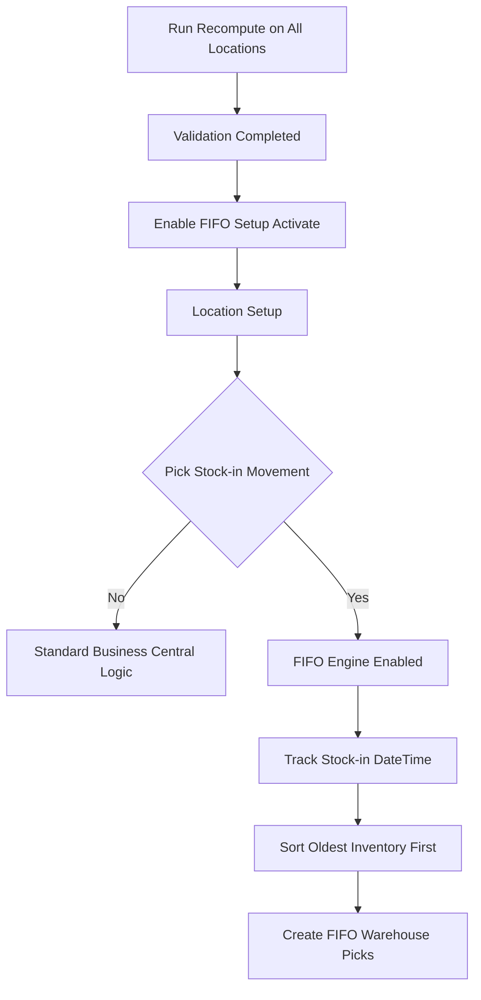

# FIFO Setup

## Purpose

The FIFO Setup controls the activation and operation of the Syntoralis FIFO Logistic extension. It provides a centralized configuration point for enabling FIFO warehouse management and works in conjunction with the FIFO settings available on individual Locations. 【1-9e0dca】

The objective is to ensure inventory is consumed according to the oldest stock-in movement date and time while maintaining compatibility with standard Business Central warehouse processes. 【1-9e0dca】

---

# Global FIFO Activation

## Activate

### Purpose

The **Activate** field is the global activation switch of the FIFO solution. It determines whether the FIFO engine is operational within the company.

When disabled, the extension remains installed, but FIFO processing is not executed. Standard Business Central warehouse behavior continues to apply. When enabled, FIFO functionality becomes available for locations configured to use FIFO stock rotation. 【1-9e0dca】

### Activation Prerequisite

Before the **Activate** field can be enabled, the FIFO initialization must be completed for all applicable locations.

The FIFO Setup activation is only intended to be performed once the warehouse data has been prepared and all locations have been successfully processed through the **Recompute** function. This ensures that FIFO data is initialized and ready for operational use. 【1-9e0dca】

> **Important:** The Recompute process must be completed on all locations before activating the FIFO solution. The details of the Recompute process are documented separately. 【1-9e0dca】

### Business Role

The field allows administrators to:

- Activate the FIFO solution during go-live.
- Temporarily suspend FIFO processing for maintenance purposes.
- Control company-wide deployment of the FIFO engine.
- Enable FIFO warehouse operations once initialization activities have been completed. 【1-9e0dca】

### Design Rule FS000

The **Activate** field must be enabled before any warehouse can operate under FIFO stock-in movement logic. It acts as the application-level prerequisite for all FIFO processes. 【1-9e0dca】

### Design Rule FS000A

The **Activate** field must remain disabled until FIFO initialization has been completed through the Recompute function for all locations included in the FIFO scope. 【1-9e0dca】

---

# Location FIFO Activation

## Pick Stock-in Movement

### Purpose

The **Pick Stock-in Movement** field acts as the location-level activation switch. It determines whether FIFO stock rotation is applied to a specific warehouse location. 【1-9e0dca】

### Design Rule FS001

FIFO processing is applied only when both conditions are met:

```text
FIFO Setup.Activate = TRUE
AND
Location.Pick Stock-in Movement = TRUE
```

If either condition is not met, standard Business Central warehouse logic is used. 【1-9e0dca】

---

# Automatic Configuration Rules

## FS002 - Pick Bin Policy

When FIFO is enabled for a location, the system automatically enforces:

```text
Pick Bin Policy = Bin Ranking
```

This ensures that warehouse picks are generated according to FIFO priorities rather than standard bin selection methods. 【1-9e0dca】

---

## FS003 - Default Bin Selection

When FIFO is activated, the system clears:

```text
Default Bin Selection
```

This prevents warehouse transactions from bypassing FIFO inventory rotation through predefined default-bin rules. 【1-9e0dca】

---

## FS004 - Bin Restrictions

FIFO-enabled locations cannot use:

- Default Bins
- Fixed Bins
- Dedicated Bins

These warehouse configurations can conflict with FIFO stock rotation principles and therefore are not supported. 【1-9e0dca】

---

# FIFO Tracking Configuration

## Stock-in DateTime

The extension adds a custom field on Bin Content:

```text
LIS-LOG-FIFO Stock-in DateTime
```

This field stores the timestamp of the stock-in movement associated with the inventory available in the bin. It serves as the primary FIFO sorting criterion used during warehouse pick generation. 【1-9e0dca】

### FIFO Sorting Rule

Inventory is always selected according to:

```text
Oldest Stock-in DateTime First
```

This guarantees FIFO stock consumption regardless of the physical bin where inventory is stored. 【1-9e0dca】

---

# FIFO Monitoring Fields

The following fields are maintained on the Location record:

```text
LIS-LOG-FIFO RecomputeDone
LIS-LOG-FIFO RecomputeDateTime
LIS-LOG-FIFO Re. MaxEntryNo
```

These fields are used internally to monitor FIFO initialization status. 【1-9e0dca】

---

# Setup Procedure

## Step 1

Execute the FIFO Recompute function for all locations that will use FIFO processing.

## Step 2

Validate that all locations have successfully completed the initialization process.

## Step 3

Open the FIFO Setup page and enable:

```text
Activate = TRUE
```

## Step 4

Open the Location Card for each warehouse location that must use FIFO logic.

## Step 5

Enable:

```text
Pick Stock-in Movement = TRUE
```

## Step 6

Verify that the system uses:

```text
Pick Bin Policy = Bin Ranking
```

## Step 7

Verify that the location does not use:

- Fixed Bins
- Dedicated Bins
- Default Bins

【1-9e0dca】

---

# Configuration Flow



---

# Key Concept

The FIFO solution operates on three mandatory stages:

1. **Recompute locations**  
   Initialize FIFO data for all locations.

2. **FIFO Setup → Activate**  
   Enable the FIFO engine at company level.

3. **Location → Pick Stock-in Movement**  
   Enable FIFO processing for a specific warehouse location.

Only when all prerequisites are met does the system apply FIFO stock consumption rules based on Stock-in DateTime and generate FIFO-compliant warehouse picks. 【1-9e0dca】

[Index](./index.html)