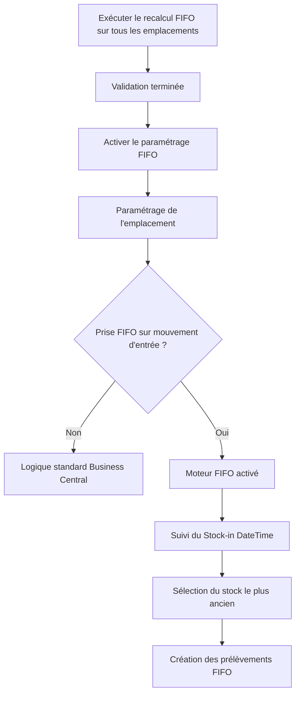

# Paramétrage FIFO

## Objectif

Le paramétrage FIFO contrôle l’activation et le fonctionnement de l’extension **Syntoralis FIFO Logistic**. Il fournit un point de configuration centralisé permettant d’activer la gestion FIFO des entrepôts et fonctionne conjointement avec les paramètres FIFO définis sur chaque emplacement (*Location*).

L’objectif est de garantir que les stocks sont consommés selon la date et l’heure du plus ancien mouvement d’entrée en stock (*Stock-in DateTime*), tout en restant compatible avec les processus standards de gestion d’entrepôt de Microsoft Dynamics 365 Business Central.

---

# Activation globale du FIFO

## Activer

### Objectif

Le champ **Activer** constitue l’interrupteur global de la solution FIFO. Il détermine si le moteur FIFO est opérationnel dans la société.

Lorsque ce champ est désactivé, l’extension reste installée mais aucun traitement FIFO n’est exécuté. Les comportements standards de gestion d’entrepôt de Business Central continuent alors de s’appliquer.

Lorsque ce champ est activé, les fonctionnalités FIFO deviennent disponibles pour les emplacements configurés pour utiliser la rotation FIFO des stocks.

### Prérequis à l’activation

Avant d’activer le champ **Activer**, l’initialisation FIFO doit être terminée pour tous les emplacements concernés.

L’activation du paramétrage FIFO ne doit être réalisée qu’une fois les données d’entrepôt préparées et tous les emplacements traités avec succès via la fonction **Recalculer (Recompute)**. Cela garantit que les données FIFO sont correctement initialisées et prêtes pour une utilisation opérationnelle.

> **Important :** Le processus de recalcul doit être exécuté sur l’ensemble des emplacements concernés avant l’activation de la solution FIFO. La description détaillée de ce processus est documentée séparément.

### Rôle métier

Ce champ permet aux administrateurs de :

- Activer la solution FIFO lors de la mise en production.
- Suspendre temporairement les traitements FIFO pour des opérations de maintenance.
- Contrôler le déploiement du moteur FIFO à l’échelle de la société.
- Autoriser les opérations d’entrepôt FIFO une fois les activités d’initialisation terminées.

### Règle de conception FS000

Le champ **Activer** doit être activé avant qu’un entrepôt puisse fonctionner selon la logique FIFO basée sur les mouvements d’entrée en stock. Il constitue le prérequis applicatif à l’ensemble des traitements FIFO.

### Règle de conception FS000A

Le champ **Activer** doit rester désactivé tant que l’initialisation FIFO n’a pas été réalisée via la fonction **Recalculer** pour l’ensemble des emplacements inclus dans le périmètre FIFO.

---

# Activation FIFO par emplacement

## Prise FIFO sur mouvement d'entrée

### Objectif

Le champ **Prise FIFO sur mouvement d'entrée** constitue l’interrupteur d’activation au niveau de l’emplacement. Il détermine si la rotation FIFO des stocks doit être appliquée à un emplacement donné.

### Règle de conception FS001

Le traitement FIFO est appliqué uniquement lorsque les deux conditions suivantes sont remplies :

```text
FIFO Setup.Activate = TRUE
ET
Location.Pick Stock-in Movement = TRUE
```

Si l’une de ces conditions n’est pas remplie, la logique standard de gestion d’entrepôt de Business Central est utilisée.

---

# Règles de configuration automatiques

## FS002 - Politique de sélection des emplacements

Lorsqu’un emplacement est configuré en FIFO, le système impose automatiquement :

```text
Pick Bin Policy = Bin Ranking
```

Cela garantit que les prélèvements sont générés selon les priorités FIFO plutôt que selon les méthodes standards de sélection des emplacements de stockage.

---

## FS003 - Sélection automatique de l’emplacement

Lorsque le FIFO est activé, le système vide le paramètre :

```text
Default Bin Selection
```

Cela empêche les transactions d’entrepôt de contourner la rotation FIFO via des règles de sélection automatiques d’emplacements.

---

## FS004 - Restrictions sur les emplacements de stockage

Les emplacements configurés en FIFO ne peuvent pas utiliser :

- Emplacements par défaut (*Default Bins*)
- Emplacements fixes (*Fixed Bins*)
- Emplacements dédiés (*Dedicated Bins*)

Ces configurations peuvent entrer en conflit avec les principes de rotation FIFO et ne sont donc pas prises en charge.

---

# Configuration du suivi FIFO

## Date/Heure d'entrée en stock

L’extension ajoute un champ personnalisé sur les contenus d’emplacement (*Bin Content*) :

```text
LIS-LOG-FIFO Stock-in DateTime
```

Ce champ stocke la date et l’heure du mouvement d’entrée associé au stock disponible dans l’emplacement.

Il constitue le principal critère de tri utilisé lors de la génération des prélèvements.

### Règle de tri FIFO

Le stock est toujours sélectionné selon la règle suivante :

```text
Le plus ancien Stock-in DateTime en premier
```

Cela garantit une consommation FIFO des stocks, indépendamment de l’emplacement physique dans lequel ils sont stockés.

---

# Champs de suivi FIFO

Les champs suivants sont maintenus sur la fiche emplacement :

```text
LIS-LOG-FIFO RecomputeDone
LIS-LOG-FIFO RecomputeDateTime
LIS-LOG-FIFO Re. MaxEntryNo
```

Ces champs sont utilisés en interne pour suivre l’état d’initialisation FIFO et les traitements de recalcul.

---

# Procédure de mise en œuvre

## Étape 1

Exécuter la fonction **Recalcul FIFO** sur tous les emplacements qui devront utiliser le traitement FIFO.

## Étape 2

Vérifier que l’initialisation est terminée avec succès pour chacun des emplacements concernés.

## Étape 3

Ouvrir la page **Paramétrage FIFO** puis activer :

```text
Activer = TRUE
```

## Étape 4

Ouvrir la fiche emplacement de chaque entrepôt devant fonctionner en FIFO.

## Étape 5

Activer :

```text
Prise FIFO sur mouvement d'entrée = TRUE
```

## Étape 6

Vérifier que le système utilise :

```text
Pick Bin Policy = Bin Ranking
```

## Étape 7

Vérifier que l’emplacement n’utilise pas :

- Emplacements fixes
- Emplacements dédiés
- Emplacements par défaut

---

# Flux de configuration



---

# Concept clé

La solution FIFO repose sur trois étapes obligatoires :

### 1. Recalcul des emplacements

Initialisation des données FIFO pour tous les emplacements concernés.

### 2. Paramétrage FIFO → Activer

Activation du moteur FIFO au niveau de la société.

### 3. Emplacement → Prise FIFO sur mouvement d'entrée

Activation du traitement FIFO pour un emplacement spécifique.

Ce n’est qu’après la validation de ces trois prérequis que le système applique les règles de consommation FIFO basées sur le **Stock-in DateTime** et génère des prélèvements conformes à la méthode FIFO.

---

[Index](./index.html)