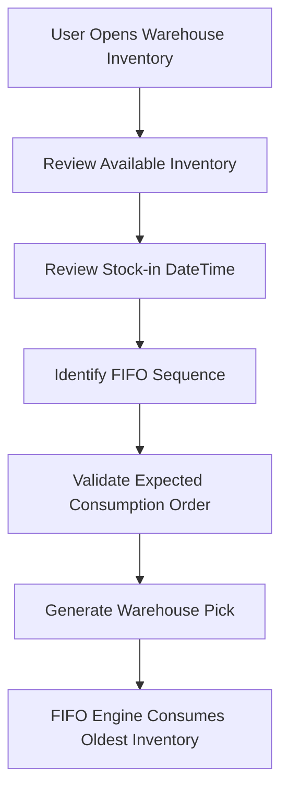

# Warehouse Inventory Page

## Purpose

The **Warehouse Inventory** page provides operational visibility into the FIFO inventory managed by the Syntoralis FIFO Logistic extension.

The page allows warehouse users, inventory controllers, and administrators to review the inventory available within a location according to the FIFO stock-in movement logic. It serves as the primary analysis tool for validating how inventory will be consumed by the FIFO engine. 

---

# Business Objective

The Warehouse Inventory page enables users to:

- View inventory available for FIFO consumption.
- Analyze stock according to Stock-in DateTime.
- Validate FIFO sequencing before warehouse picks are created.
- Investigate inventory discrepancies.
- Support FIFO recomputation validation activities.
- Provide visibility into lot and serial tracked inventory participating in FIFO allocation. 

---

# Access

The Warehouse Inventory page can be accessed directly from FIFO-enabled warehouse configuration pages.

### Location Card

Action available:

```text
Open Warehouse Inventory
```


### Bin Content

Action available:

```text
Open Warehouse Inventory
```

### Bin Contents

Action available:

```text
Open Warehouse Inventory
```

### Bin Contents List

Action available:

```text
Open Warehouse Inventory
```


---

# Functional Role

The Warehouse Inventory page acts as the functional bridge between:

- Warehouse Entries
- Bin Contents
- FIFO Stock-in DateTime
- Warehouse Pick Generation

It provides a consolidated view of inventory that will be considered by the FIFO engine during warehouse operations. 

---

# FIFO Visibility

## Stock-in DateTime

The page exposes the FIFO sequencing information through:

```text
LIS-LOG-FIFO Stock-in DateTime
```

This value represents the stock-in timestamp used by the FIFO engine to prioritize inventory consumption. 

### FIFO Principle

Inventory displayed with the oldest Stock-in DateTime is consumed first during warehouse pick generation. 

---

# Business Rules

## WI001 - FIFO Ordering

Warehouse inventory is evaluated according to:

```text
Oldest Stock-in DateTime First
```

The page allows users to verify the expected FIFO sequence before warehouse activities are created. 

---

## WI002 - FIFO Inventory Analysis

Users can review available inventory and determine:

- Which stock will be consumed first.
- Which stock remains available.
- Which bins currently contain the oldest inventory. 

---

## WI003 - Tracking Visibility

For lot-tracked and serial-tracked items, the page assists users in understanding which inventory layers are eligible for FIFO consumption. 

---

## WI004 - Audit and Validation

The page can be used as a validation tool after FIFO initialization and recomputation activities to confirm inventory ordering is aligned with expected FIFO behavior. 

---

# Typical Use Cases

## Verify FIFO Before Picking

A warehouse manager reviews inventory for an item and confirms that the oldest stock appears first in the FIFO sequence before generating warehouse picks.

---

## Investigate Unexpected Stock Consumption

A user reviews warehouse inventory to determine why a specific lot, serial number, or bin was selected by the FIFO engine.

---

## Validate Go-Live Preparation

After initialization activities have been completed, inventory controllers review the Warehouse Inventory page to verify FIFO ordering before activating the solution company-wide.

---

## Analyze Remaining FIFO Inventory

Users review current inventory layers and identify which stock remains available for future warehouse consumption.

---

# User Benefits

The Warehouse Inventory page provides:

- Full visibility of FIFO inventory.
- Transparency of warehouse pick decisions.
- Easier troubleshooting of warehouse operations.
- Validation support during deployment and maintenance activities.
- Improved confidence in FIFO stock rotation processes. 

---

# Process Flow



---

# Key Concept

The Warehouse Inventory page is a **visibility and control page**. It does not itself perform FIFO calculations but presents the inventory data used by the FIFO engine. Users can therefore understand, validate, and troubleshoot the inventory sequence that will drive warehouse pick generation and stock consumption.