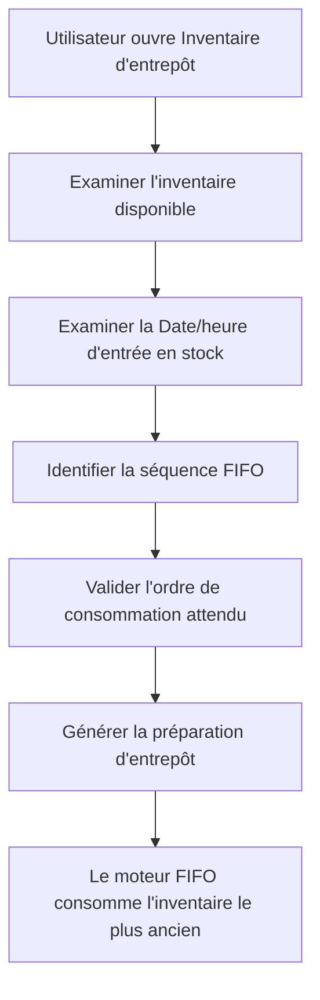

# Page Inventaire d'entrepôt

## Objectif

La page **Inventaire d'entrepôt** fournit une visibilité opérationnelle sur l'inventaire FIFO géré par l'extension Syntoralis FIFO Logistic.

La page permet aux utilisateurs d'entrepôt, aux contrôleurs d'inventaire et aux administrateurs d'examiner l'inventaire disponible dans un emplacement selon la logique de mouvements d'entrée FIFO. Elle sert d'outil principal d'analyse pour valider comment l'inventaire sera consommé par le moteur FIFO.

---

# Objectif métier

La page Inventaire d'entrepôt permet aux utilisateurs de :

- Voir l'inventaire disponible pour la consommation FIFO.
- Analyser le stock selon la date/heure d'entrée en stock.
- Valider la séquence FIFO avant la création des préparations (picks) d'entrepôt.
- Examiner les écarts d'inventaire.
- Supporter les activités de validation de recomputation FIFO.
- Fournir la visibilité sur les inventaires suivis par lot et par numéro de série participant à l'allocation FIFO.

---

# Accès

La page Inventaire d'entrepôt est accessible directement depuis les pages de configuration d'entrepôt activées pour FIFO.

### Fiche Emplacement

Action disponible :

```text
Ouvrir Inventaire d'entrepôt
```


### Contenu du Bac

Action disponible :

```text
Ouvrir Inventaire d'entrepôt
```


### Contenus des Bacs

Action disponible :

```text
Ouvrir Inventaire d'entrepôt
```


### Liste des Contenus des Bacs

Action disponible :

```text
Ouvrir Inventaire d'entrepôt
```


---

# Rôle Fonctionnel

La page Inventaire d'entrepôt fait le lien fonctionnel entre :

- Entrées d'entrepôt
- Contenus des bacs
- Date/heure d'entrée FIFO
- Génération de préparations d'entrepôt

Elle fournit une vue consolidée de l'inventaire qui sera pris en compte par le moteur FIFO lors des opérations d'entrepôt.

---

# Visibilité FIFO

## Date/heure d'entrée en stock

La page expose l'information de séquençage FIFO via :

```text
LIS-LOG-FIFO Date/heure d'entrée en stock
```

Cette valeur représente l'horodatage d'entrée en stock utilisé par le moteur FIFO pour prioriser la consommation d'inventaire.

### Principe FIFO

L'inventaire affiché avec la plus ancienne Date/heure d'entrée en stock est consommé en premier lors de la génération des préparations d'entrepôt.

---

# Règles Métier

## WI001 - Ordre FIFO

L'inventaire d'entrepôt est évalué selon :

```text
Plus ancienne Date/heure d'entrée en stock en premier
```

La page permet aux utilisateurs de vérifier la séquence FIFO attendue avant la création des activités d'entrepôt.

---

## WI002 - Analyse de l'inventaire FIFO

Les utilisateurs peuvent examiner l'inventaire disponible et déterminer :

- Quel stock sera consommé en premier.
- Quel stock reste disponible.
- Quels bacs contiennent actuellement l'inventaire le plus ancien.

---

## WI003 - Visibilité du suivi

Pour les articles tracés par lot et par numéro de série, la page aide les utilisateurs à comprendre quelles couches d'inventaire sont éligibles à la consommation FIFO.

---

## WI004 - Audit et Validation

La page peut être utilisée comme outil de validation après l'initialisation et les activités de recomputation FIFO pour confirmer que l'ordre d'inventaire est conforme au comportement FIFO attendu.

---

# Cas d'utilisation typiques

## Vérifier le FIFO avant préparation

Un responsable d'entrepôt examine l'inventaire pour un article et confirme que le stock le plus ancien apparaît en premier dans la séquence FIFO avant de générer les préparations d'entrepôt.

---

## Enquêter sur une consommation de stock inattendue

Un utilisateur consulte l'inventaire d'entrepôt pour déterminer pourquoi un lot, un numéro de série ou un bac spécifique a été sélectionné par le moteur FIFO.

---

## Valider la préparation de mise en production

Après les activités d'initialisation, les contrôleurs d'inventaire examinent la page Inventaire d'entrepôt pour vérifier l'ordre FIFO avant d'activer la solution à l'échelle de l'entreprise.

---

## Analyser l'inventaire FIFO restant

Les utilisateurs examinent les couches d'inventaire actuelles et identifient quel stock reste disponible pour de futures consommations d'entrepôt.

---

# Bénéfices pour l'utilisateur

La page Inventaire d'entrepôt fournit :

- Visibilité complète de l'inventaire FIFO.
- Transparence des décisions de préparation d'entrepôt.
- Facilitation du dépannage des opérations d'entrepôt.
- Support de validation lors du déploiement et de la maintenance.
- Confiance accrue dans les processus de rotation FIFO des stocks.

---

# Flux de processus



---

# Concept clé

La page Inventaire d'entrepôt est une **page de visibilité et de contrôle**. Elle n'effectue pas elle-même les calculs FIFO mais présente les données d'inventaire utilisées par le moteur FIFO. Les utilisateurs peuvent ainsi comprendre, valider et dépanner la séquence d'inventaire qui pilotera la génération des préparations d'entrepôt et la consommation des stocks.

---

[Index](./index.html)